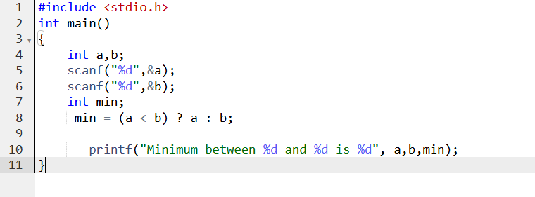
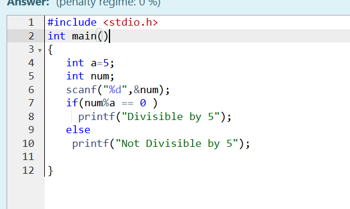
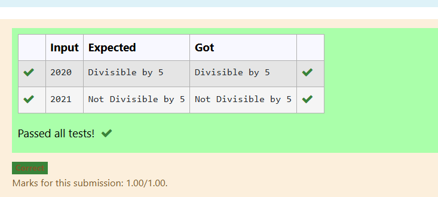

## Name: RICKY DHARMESH .P
## Reg no.: 25016025
# EX-01-Datatypes-Operators
## AIM:
Write a C program to read a float value from the user and display the same value as an output.

## ALGORITHM:
1.Start the program.

2.Declare a variable of type float.

3.Read a float value from the user using scanf().

4.Display the entered float value using printf().

## PROGRAM:

## OUTPUT:

## RESULT:
Thus the program to read 3 characters one by one and print the characters in a reverse order has been executed successfully.

# EX-02- Conditional-Statements
## AIM:
Write a C program to read  N value and check that value is equal to 0 or not using if-else

# ALGORITHM:
1.Start the program.

2.Read an integer value N from the user.

3.Check if N is equal to 0 using an if condition.

4.If true, display “N is equal to 0”, else display “N is not equal to 0”.
# PROGRAM:

# OUTPUT:

# RESULT:
Thus the program to read A values and check whether A is positive number or not has been executed successfully.
 
 
 

# EX-03- Operators-Expressions
## AIM:
Write a C program to find minimum between two given integer values(For ex: a=100 b=1200) using conditional operator or ternary operator.

## ALGORITHM:
1.Start the program.

2.Declare two integer variables a and b.

3.Read the values of a and b from the user.

4.Use the conditional (ternary) operator ? : to find the minimum value.

5.Display the minimum value as output.

## PROGRAM:

## OUTPUT:

.png>)

## RESULT:
Thus the program to find minimum between two fraction numbers using conditional operator or ternary operator has been executed successfully.

# EX-04- Using Conditional Statements

## AIM:
Write a C program to read a number and check whether the number is divisible by 5 or not using  if else

## ALGORITHM:
1.Start the program.

2.Declare an integer variable num.

3.Read the value of num from the user.

4.Check if num is divisible by 5 using the condition num % 5 == 0.

5.If the condition is true, display “Number is divisible by 5”.

6.Otherwise, display “Number is not divisible by 5”.

## PROGRAM:

## OUTPUT:

	

## RESULT:
Thus the program to check whether the input value is equal to 1 using simple if statement has been executed successfully

# EX-05- Calculating Total, Percentage, And Division Using Conditional Statements 
## AIM:
Write a C program to calculate total, average and percentage of five subjects. 
## ALGORITHM:
1.	Start the program.

2. Declare five float variables — en, mat, ph, chem, and tam — to store marks of 5 subjects.

3. Read the marks of all five subjects from the user using scanf().

4. Declare three float variables — total, avg, and per.

5. Calculate the total marks using the formula
total = en + mat + ph + chem + tam.

6. Calculate the average marks using the formula
avg = total / 5.

7. Assign percentage as equal to average:
per = avg.

8. Display the total, average, and percentage using printf().
## PROGRAM:

## OUTPUT:
.png>)
## RESULT:
The program successfully takes three subject marks, calculates the total and percentage, and correctly determines the division based on predefined grading logic.

