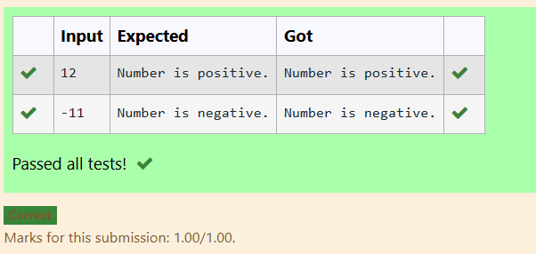

## Name: VANATHI T
## Reg no.:25013590
# EX-01-Datatypes-Operators
## AIM:
Write a C program to read 3 characters one by one and print the characters in a reverse order.

## ALGORITHM:
1.	Declare three character variables to store the input characters.
2.	Use the scanf function to read the characters one by one from the user.
3.	Print the characters in reverse order using the printf function.
4.	End the program.

## PROGRAM:
```
#include <stdio.h>
int main ()
{
    char a,b,c;

    scanf("%c",&a);
    
    scanf("%c",&b);
    
    scanf ("%c",&c);
    printf("The reverse of %c%c%c is %c%c%c",a,b,c,c,b,a);
    return 0;
}

```

## OUTPUT:


## RESULT:
Thus the program to read 3 characters one by one and print the characters in a reverse order has been executed successfully.


# EX-02- Conditional-Statements
## AIM:
Write a C program to check whether a number is positive or negative using if-else


# ALGORITHM:

1. Declare an integer variable num.

2. Read the value of num from the user using scanf().

3. Check if num >= 0:

4. If true, print "Number is positive."

5. Otherwise, print "Number is negative."

# PROGRAM:

```
#include <stdio.h>

int main()
{
    int num;
    scanf("%d", &num);
    
    if(num >=0)
    {
        
        printf("Number is positive.");
    }
    else
    {
       
        printf("Number is negative.");
    }

    return 0;
}
```

# OUTPUT:




# RESULT:

Thus, the program to read a value and check whether it is a positive number or not has been executed successfully. 
 
 


# EX-03- Operators-Expressions
## AIM:
Write a C program to find Minimum between two given integer values(a=-1000 b=-1500) using conditional operator( ternary operator).

## ALGORITHM:
1.	Declare variables to store the two integer numbers and the result.
2.	Use the printf function to prompt the user to enter the first integer number .
3.	Use the scanf function to read the first and second integer number.
4.	Use the conditional (ternary) operator to compare two numbers and store the minimum value in the result variable.
7.	Print the minimum value.

## PROGRAM:
```
#include <stdio.h>
int main(){
    int a,b,min;
    scanf("%d %d",&a,&b);
    min = (a<b)? a:b;
    printf("Minimum between %d and %d is %d",a,b,min);
    return 0;
}

```

## OUTPUT:


## RESULT:
Thus the program to find minimum between two given integer numbers using conditional operator or ternary operator has been executed successfully.


# EX-04- Using Conditional Statements

## AIM:
Write a C program to read a, b value and check whether they are equal or not. using  if else


## ALGORITHM:
1. Start the program.

2. Declare an integer variable num.

3. Read the value of num from the user using scanf().

4. If num >= 0, then print "Number is positive."

5. Otherwise, print "Number is negative".

## PROGRAM:
```
#include<stdio.h>
int main()
{
    int a,b;
    scanf("%d %d",&a,&b);
    if(a==b){
        printf("Both the values are equal.");
    }
    else{
        printf("Both the values are Not equal.");
    }
    return 0;
}

```
## OUTPUT:


## RESULT:
Thus, the program to read a value and check whether it is a positive number or not has been executed successfully.


# EX-05- Calculating Total, Percentage, And Division Using Conditional Statements 
## AIM: 
TO write a C program to calculate total, average and percentage of five subjects.

## ALGORITHM:

1.	Start the program.

2. Declare five float variables — en, mat, ph, chem, and tam — to store marks of 5 subjects.

3. Read the marks of all five subjects from the user using scanf().

4. Declare three float variables — total, avg, and per.

5. Calculate the total marks using the formula
total = en + mat + ph + chem + tam.

6. Calculate the average marks using the formula
avg = total / 5.

7. Assign percentage as equal to average:
per = avg.

8. Display the total, average, and percentage using printf().

## PROGRAM:
```
#include <stdio.h>
int main()
{
    float en,mat,ph,chem,tam;
    scanf("%f%f%f%f%f",&en,&mat,&ph,&chem,&tam);
    float total,avg,per;
    total=en+mat+ph+chem+tam;
    avg=total/5;
    per=avg;
    printf("Total marks = %.2f\n",total);
    printf("Average marks = %.2f\n",avg);
    printf("Percentage = %.2f",per);
}
```
## OUTPUT:


## RESULT:
The program successfully takes five subject marks, calculates the total and percentage, and correctly determines the division based on predefined grading logic.

